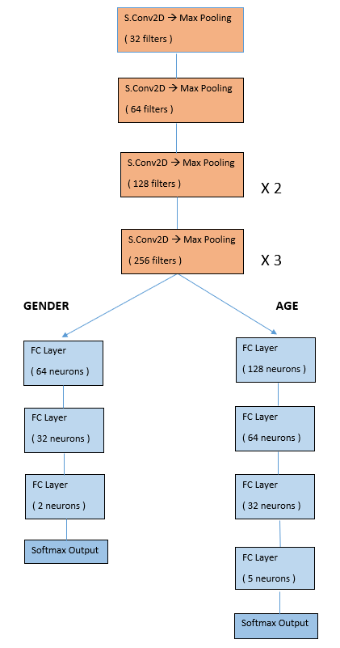
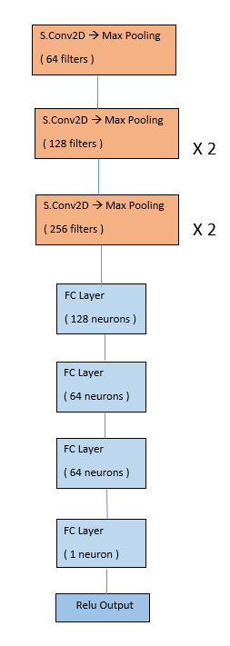
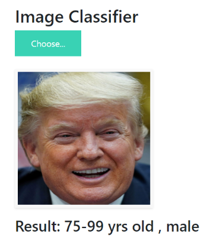
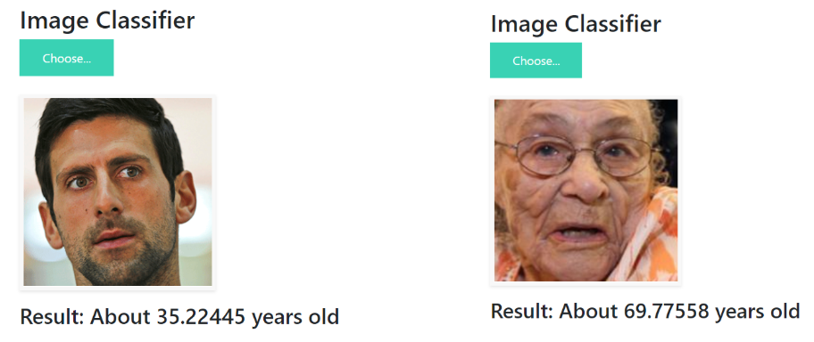

## Overview
The basic goal of the project was to predict the age and gender of a person, given his/her facial image using Convolutional Neural Network. Both the models were trained on top of **Keras API** (which is in turn built on top of Tensorflow) and finally deployed in **Flask**.

**Note: For training purposes, I made use of Tesla K80 GPU available for free on Google Colab.**

This project includes 2 seperate tasks  -
* **Age & Gender Classification** - This model classifies ages into 5 categories: 0-24, 25-49, 50-74, 75-99, 100-124 and gender into 2 categories: male, female. The model was trained on *UTKFace* dataset (23,708 images) and attained a validation accuracy of 0.8279 and 0.9502 on age and gender classification respectively.
  
*Model architecture* - 

       

* **Age Estimation** - This was a regression task. The model was trained on *WIKIFace* dataset (34,200 images). The model attained a validation mae of 6.55 which shows the average magnitude of error in predicting age.

*Model architecture* -

  

## Working Demo Screenshot

                                                                                   

 

## Motivation
I created this end-to-end project in my 6 week internship at **Silver Touch Technologies Ltd.**, which was held under PS1 program of BITS Pilani. We were a team of 4 members and everyone was assigned to work on different approaches to tackle this problem. I was assigned to create a CNN from scratch. Special thanks to the entire SilverTouch team for providing this wonderful opportunity to me.  

## Technical Details
For detailed analysis, please refer to the report I have uploaded in this repository.

## To do
1. Add a face-detection algorithm such as Dlib, MTCNN so that user need not crop the image manually before uploading.
2. Deploy the model on a web server using AWS/Heroku so that it is available for use across the globe. Right now, it can only be hosted locally using Flask.

## Credits

#### Research Papers - 
* https://ieeexplore.ieee.org/stamp/stamp.jsp?arnumber=8361072
* http://cs231n.stanford.edu/reports/2016/pdfs/003_Report.pdf
* https://www.hindawi.com/journals/mpe/2018/1712686/
* https://arxiv.org/pdf/1710.02985.pdf

#### Dataset - 
* UTKFace - http://aicip.eecs.utk.edu/wiki/UTKFace
* WIKI Face - https://data.vision.ee.ethz.ch/cvl/rrothe/imdb-wiki/

 ## License
 Copyright 2020 Shreyansh Joshi

Licensed under the Apache License, Version 2.0 ("License"); you may not use this file except in compliance with the License. You may obtain a copy of the License at

`http://www.apache.org/licenses/LICENSE-2.0`

Unless required by applicable law or agreed to in writing, software distributed under the License is distributed on an "AS IS" BASIS, WITHOUT WARRANTIES OR CONDITIONS OF ANY KIND, either express or implied. See the License for the specific language governing permissions and limitations under the License.

## Technologies Used

 
                  
                  
                

                                                                   
