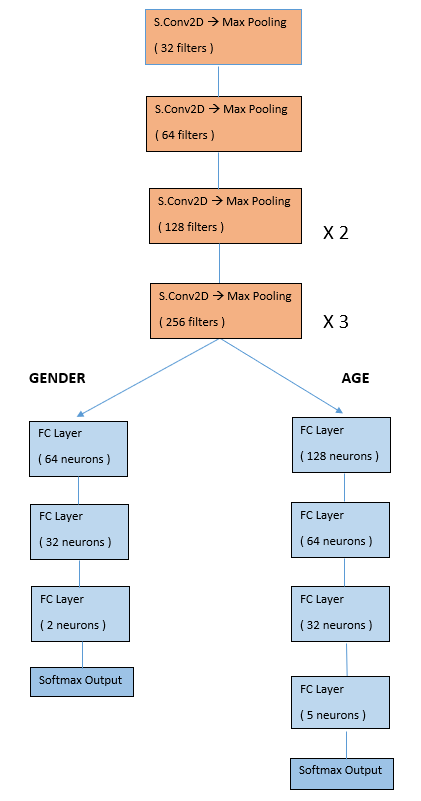
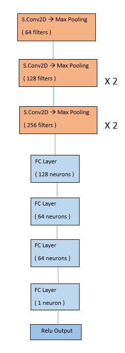
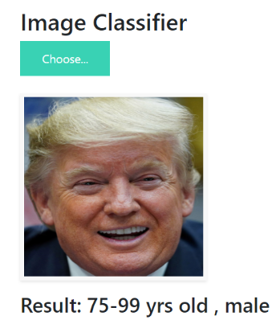
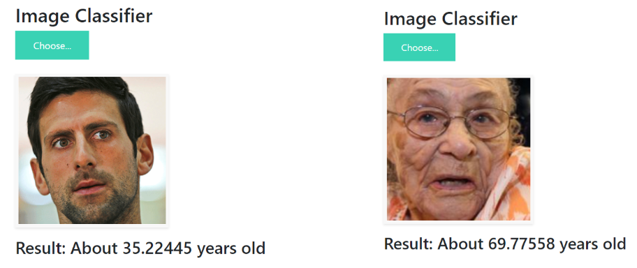

# Age & Gender Prediction from facial images

## Overview
The basic goal of the project was to predict the age and gender of a person, given his/her facial image using Convolutional Neural Network. Both the models were trained on top of **Keras API** (which is in turn built on top of Tensorflow) and finally deployed in **Flask**.

**Note: For training purposes, I made use of Tesla K80 GPU available for free on Google Colab.**

This project includes 2 seperate tasks  -
* **Age & Gender Classification** - This model classifies ages into 5 categories: 0-24, 25-49, 50-74, 75-99, 100-124 and gender into 2 categories: male, female. The model was trained on *UTKFace* dataset (23,708 images) and attained a validation accuracy of 0.8279 and 0.9502 on age and gender classification respectively.
  
*Model architecture* - 

       

* **Age Estimation** - This was a regression task. The model was trained on *WIKIFace* dataset (34,200 images). The model attained a validation mae of 6.55 (the average magnitude of error in predicting the exact age).

*Model architecture* -

  

## Working-demo screenshot

                                                                                   

 

## Motivation
I created this end-to-end project in my 6 week internship at **Silver Touch Technologies Ltd.** which was held under PS1 program of BITS Pilani. We were a team of 4 members and everyone was assigned to work on different approaches to tackle this problem. I was assigned to create a CNN from scratch. Special thanks to the entire SilverTouch team for providing this wonderful opportunity to me.

### Importance in real world
Recognizing a person is perhaps the most subconscious task done in our daily lives- right from waking up and recognizing our loved-ones to recognizing our boss at work. And the 2 most fundamental things required to identify someone are age & gender. With AI increasingly augmenting our lives, no doubt this is one of the hottest fields in computer science these days. The goal of this project is to analyse the demographics of any population by just looking at their faces and predicting their age and gender. Here are some real life applications of this project-
* **Embedding with IoT and making a real life solution.** A simple e.g - Fit a camera outside a bar/restaurant that clicks photos of people entering. When sufficient number of people have entered, run the model on their stored faces and get the average age and gender. Accordingly, play the music / change the lights by integrating IoT into the system.

* **Forensics** - To predict the age/gender of a dead person. This project can be extended to train on images of skeletons. In that case, it would be able to predict the age and gender of a person whose skeleton has been found. Perhaps even a skeleton belonging to the Stone Age !

* **Missing person identification** - Suppose we know someone has got lost in a neighborhood. The person filing the complaint, could feed the age and gender of the lost person into a machine. And assuming CCTV cameras are installed at each road junction, the model might filter out images of those people whose age and gender that it predicted matches with the inputted information. This might not solve the problem completely, but surely reduces the search space by a mile. 

## Technical Details
For detailed analysis, please refer to the report I have uploaded in this repository.

## Local testing
Step 1 - Install (upgrade) the latest version of pip, python, tensorflow, keras using Anaconda prompt on Windows, or Terminal if you are using Linux or macOS.
The command for checking the latest version of anything (say tensorflow) is to type `pip install tensorflow==`. 
To install a version (say 2.2) type `pip install tensorflow==2.2`

Step 2  - Clone any one of (or both) - **Age & Gender Prediction , Age Estimation** present inside the **Deployment** folder . Store it somewhere on your local machine.

Step 3 - Go into the directory of any folder that you cloned and type `python app.py` on Anaconda Prompt. From that location, **app.py** file should be directly accessible.

Step 4 - A server is hosted locally and the model has been deployed. Go to that server (http://127.0.0.1:5000/) and upload a cropped image.

Note: Since, the datasets used by me were highly imbalanced (yet very popular :) ) (as you would see in the report/notebooks), **the model is bound to make better predictions when the actual age lies between 23-24 to about 80 (especially the Age Estimation one. For age estimation pls upload only images between 25-75 yrs old as its dataset (WIKI) had 90 % images within that range.)** 

## To do
1. Add a face-detection algorithm such as Dlib, MTCNN so that user need not crop the image manually before uploading.
2. Deploy the model on a web server using AWS/Heroku so that it is available for use across the globe. Right now, it can only be hosted locally using Flask.

## Credits

#### Research Papers - 
* https://ieeexplore.ieee.org/stamp/stamp.jsp?arnumber=8361072
* http://cs231n.stanford.edu/reports/2016/pdfs/003_Report.pdf
* https://www.hindawi.com/journals/mpe/2018/1712686/
* https://arxiv.org/pdf/1710.02985.pdf

#### Dataset - 
* UTKFace - http://aicip.eecs.utk.edu/wiki/UTKFace
* WIKI Face - https://data.vision.ee.ethz.ch/cvl/rrothe/imdb-wiki/

 ## License
 Copyright 2020 Shreyansh Joshi

Licensed under the Apache License, Version 2.0 ("License"); you may not use this file except in compliance with the License. You may obtain a copy of the License at

`http://www.apache.org/licenses/LICENSE-2.0`

Unless required by applicable law or agreed to in writing, software distributed under the License is distributed on an "AS IS" BASIS, WITHOUT WARRANTIES OR CONDITIONS OF ANY KIND, either express or implied. See the License for the specific language governing permissions and limitations under the License.

## Technologies Used

 

                  
                

                                                                   
